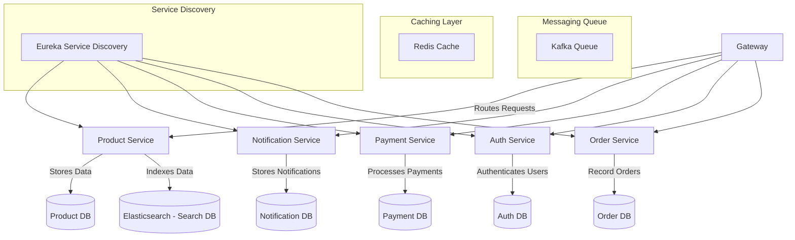

## Shopping Microservices
 **Personal POC Project**: This is a Personal Proof of Concept (POC) Project, developed to explore Spring Boot and gain a deeper understanding of microservices architecture. The application simulates a shopping platform backend, covering essential microservices concepts such as:

- **Service Discovery**: Spring Netflix Eureka  
- **API Gateway**: Spring Cloud Gateway  
- **Load Balancing**: AWS Application Load Balancer (ALB)  
- **Containerization**: Docker, Kubernetes  
- **Persistence**: Elasticsearch, relational databases 
- The primary goal of this project is to experiment with Spring Boot features, understand distributed system behavior, and learn how different microservices interact in a cloud environment.

## Applications

These are few microservices which are getting used in this project.

| **Service Name**                                                        | **Default Port** | **Dependency**                                         | **Description**                                                                                       |
|-------------------------------------------------------------------------|------------------|--------------------------------------------------------|-------------------------------------------------------------------------------------------------------|
| [prodcuct](https://github.com/taraksuthar1999/productService)           | 8080             | serviceDiscovery, MySQL, Elasticsearch, Redis, Kafka   | Manages product catalog, including product details, pricing, and inventory along with cart.           |
| [auth](https://github.com/taraksuthar1999/authservice)                  | 8080             | serviceDiscovery, MySQL, Kafka                         | Handles user authentication, registration, and authorization using JWT and OAuth2.                    |
| [notification](https://github.com/taraksuthar1999/notificationservice)  | 8080             | serviceDiscovery, Kafka                                | Sends email notifications for sign-up, order confirmations, payment updates, etc.                     |
| [gateway](https://github.com/taraksuthar1999/gateway)                   | 443,80:8080      | serviceDiscovery, auth                                 | Acts as an API Gateway (Spring Cloud Gateway) routing requests to appropriate microservices.          |
| [serviceDiscovery](https://github.com/taraksuthar1999/servicediscovery) | 8761             | -                                                      | Eureka Server for service discovery, enabling dynamic registration and load balancing.                |
| [payment](https://github.com/taraksuthar1999/paymentservice)            | 8080             | serviceDiscovery, MySQL, Kafka                         | Handles payment processing, integrating with third-party payment gateways.                            |

For further information about the component you can click on the Service.

## Databases

These applications are using two kinds of databases, one is structured and other is non-structured.

| **Application Name** | **Dependency** | **Description**                                                                                                  |
|----------------------|----------------|------------------------------------------------------------------------------------------------------------------|
| [elastic]()          | -              | Elasticsearch is used as a NoSQL search engine for fast indexing and retrieval of product and order data.        |
| [mysql]()            | -              | MySQL is the primary relational database, storing structured data such as products, users, orders, and payments. |
| [redis]()            | -              | Redis is used as an in-memory cache to speed up database queries and store session data.                         |
| [kafka]()            | -              | Apache Kafka is used as a message broker to enable event-driven communication between microservices.             |

## Architecture

The architecture of the complete microservice interaction looks like this:-

## Current URL
[https://shopping-backend-api.taraksuthar.me/login](https://shopping-backend-api.taraksuthar.me/login)

## Screenshot

  

## Contact

If you have any suggestion or query. Contact me at

tarak.suthar1999@gmail.com
